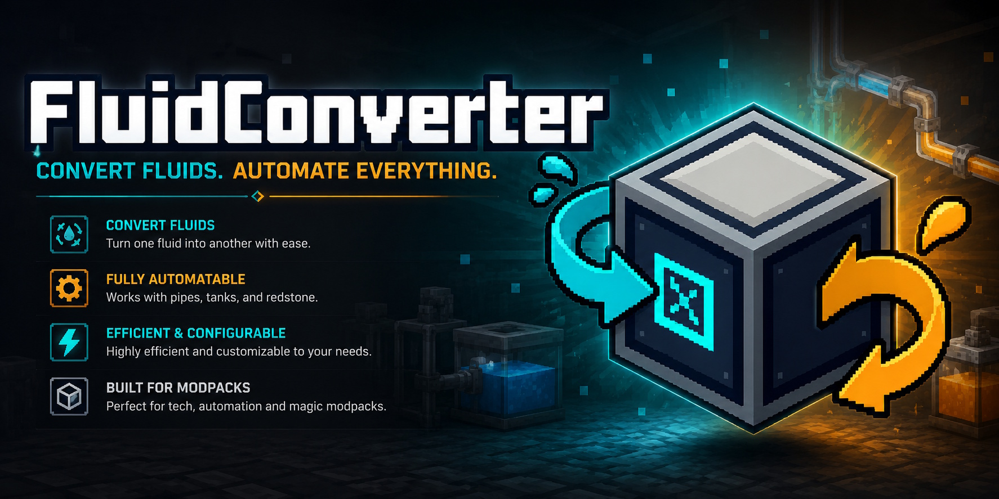

# Fluid Converter

A small NeoForge mod that adds one block: a machine that converts one fluid into another.

Built for **Minecraft 1.21.1** on **NeoForge 21.1.228**.

## Why

Modded packs end up with five different "molten steel" or three flavours of "crude oil" depending on which mod you piped them from. The Fluid Converter lets you turn one into another in-world, without giving up your existing tanks. Pairs can be taught live in-game (no datapack required), shipped as a datapack for modpack authors, or both at once.

## How it works

Place the block, open it, and you'll see two tanks (input on the left, output on the right). Pipe a fluid into a face you've set to **Input**, set another face to **Output**, and pick what you want to convert to. The machine drains the input and fills the output at a configurable rate.

Face roles are set from the GUI: open the converter and click the **Sides** button to bring up a face-config panel (unfolded-cube layout). Click each face to cycle it between Input, Output and Disabled. Configured faces show a coloured overlay on the block in-world — cyan for input, orange for output. Any face can take either role; the block has no fixed front.

A wrench (any item tagged `c:tools/wrench` or `c:tools/wrenches`) rotates the block clockwise on use, and shift-wrench picks the block up with its per-block state preserved: side roles, redstone mode, selected output, tank contents and buffered energy. (Learned recipes are server-wide, so they don't travel with the block — they stay available wherever you place it again.)

If you want the machine to stop without breaking the pipework, hit **Pause** in the GUI. **Drain** buttons next to each tank dump that tank's contents.

A **redstone** button in the GUI cycles through three modes: ignore the signal entirely (default), only run when powered, or only run when *un*powered. The choice is per-block and persists in NBT, so a wrenched-and-replaced converter keeps its mode.

## Teaching the converter

Conversion pairs aren't built in. You teach them.

If you're an operator or in creative, the GUI shows an **Admin** button. Open it, pick an input fluid and an output fluid, save. From then on, every Fluid Converter on the server knows that pair (and its reverse). Pairs are stored in `config/fluidconverter/learned_recipes.json` — the global config dir, not the per-world one — and persist across restarts.

Server admins who don't want this exposed to players at all can set `admin_menu_enabled = false` in the config — the button disappears entirely. The commands below still work from the server console regardless.

## Commands

Ops (permission level 2+) can manage learned pairs from chat or the server console. Non-ops don't see the command at all in autocomplete.

| Command | What it does |
| --- | --- |
| `/fluidconverter recipe list` | Print every learned pair. |
| `/fluidconverter recipe learn <inFluid> <inAmount> <outFluid> <outAmount> [reverse]` | Add a pair. Fluid IDs autocomplete from the registry. `reverse` (`true`/`false`, optional, default `true`) controls whether the reverse direction is auto-generated at runtime. |
| `/fluidconverter recipe forget <inFluid> <outFluid>` | Remove a pair. The IDs autocomplete from existing pairs only. |
| `/fluidconverter recipe clear` | Wipe all learned pairs. |

After any mutation the changes are broadcast to every connected player, so admin screens that are open update in real time.

## The recipe file

Learned pairs are written to `config/fluidconverter/learned_recipes.json`. It's a plain JSON array of objects, one per pair, and you can edit it by hand on a stopped server if you want to ship a pack with conversions already in place.

Minimal example:

```json
[
  {
    "input":  { "id": "tfmg:molten_steel",       "amount": 90 },
    "output": { "id": "bigcannons:molten_steel", "amount": 144 }
  },
  {
    "input":  { "id": "minecraft:lava",          "amount": 1000 },
    "output": { "id": "create:honey",            "amount": 1000 },
    "reverse": false
  }
]
```

Each entry has two required fields and one optional one:

| Field | Type | Required | Default | Description |
| --- | --- | --- | --- | --- |
| `input` | FluidStack | yes | — | The fluid drained from the input tank, and the minimum amount required for one cycle. |
| `output` | FluidStack | yes | — | The fluid produced and the amount filled into the output tank per cycle. |
| `reverse` | bool | no | `true` | When `true`, the converter also accepts `output → input` at runtime. Set to `false` for one-way conversions. |

A FluidStack is the standard NeoForge format:

| Field | Type | Required | Default | Notes |
| --- | --- | --- | --- | --- |
| `id` | string | yes | — | Fluid registry name, e.g. `minecraft:water`. |
| `amount` | int | no | `1` | Millibuckets. For converter recipes you'll almost always set this. |
| `components` | object | no | `{}` | Data components on the fluid (NBT-like). Usually omitted. |

Pairs default to bidirectional (`reverse: true`): the converter accepts both `input → output` and `output → input` at runtime. Set `"reverse": false` to make a pair one-way. The in-game Admin panel exposes the same toggle as a clickable arrow between the two fluid slots — `↔` for bidirectional, `→` for one-way.

Editing the file while the server is running is not recommended — the in-memory list is the source of truth and will be overwritten on the next learn/forget.

## Datapack recipes

Pairs can also be shipped as a datapack, which is the right choice if you're a modpack author and want them versioned alongside the rest of the pack. The recipe type is `fluidconverter:converting`.

Path: `data/<your-namespace>/recipe/<anything>.json`

```json
{
  "type": "fluidconverter:converting",
  "input":  { "id": "minecraft:water", "amount": 100 },
  "output": { "id": "minecraft:lava",  "amount": 50  },
  "reverse": true
}
```

| Field | Type | Required | Default | Description |
| --- | --- | --- | --- | --- |
| `type` | string | yes | — | Must be `"fluidconverter:converting"`. |
| `input` | FluidStack | yes | — | The fluid drained from the input tank, and the minimum amount required for one cycle. Same FluidStack shape as in `learned_recipes.json`. |
| `output` | FluidStack | yes | — | The fluid produced and the amount filled into the output tank per cycle. |
| `reverse` | bool | no | `true` | When `true`, the converter also accepts `output → input` at runtime. Set to `false` for one-way conversions. |

**Datapack vs. learned recipes — when to use which:**

|  | Datapack | `learned_recipes.json` |
| --- | --- | --- |
| Editor | Pack author, files | Op in-game (GUI or `/fluidconverter recipe …`) |
| Reload | `/reload` picks up changes live | Loaded on server start; commands/GUI mutate live |
| Reverse direction | Controlled by `reverse` field (default `true`). | Controlled by `reverse` field (default `true`); GUI/command toggles it. |
| Scope | Per-world (datapacks are per-world) | Server-wide (lives in `config/`, shared across worlds) |

Both sources are merged at runtime, so a datapack pair and a learned pair can coexist. No precedence — if both define the same `input → output`, the converter just sees the same option twice with no ill effect.

## Energy

On by default: the machine asks for Forge Energy (FE) to run. Power is accepted on every face regardless of side configuration, so cables can share faces with pipes without you having to plan around it. The defaults are gentle (10 FE per mB converted, 100k FE buffer). Flip `enabled = false` in the energy section if you want a free machine.

## Config

The file lives at `<world>/serverconfig/fluidconverter-server.toml`. It's a **server-type** config, so on a dedicated server the values are authoritative and pushed to every client on join — no more progress-bar desync if the client's local rate differs.

| Key | Default | What it does |
| --- | --- | --- |
| `machine.conversion_rate_mb_per_tick` | `20` | mB drained from input and filled into output per server tick. |
| `machine.tank_capacity_mb` | `8000` | Size of each internal tank. |
| `machine.admin_menu_enabled` | `true` | Whether ops/creative players can open the Admin panel. |
| `energy.enabled` | `true` | Require FE to operate. |
| `energy.capacity_fe` | `100000` | Internal energy buffer. |
| `energy.cost_per_mb` | `10` | FE consumed per mB. Set to `0` to disable the cost without hiding the bar. |

## Build

You need a JDK 21. From the repo root:

```
./gradlew build       # produces build/libs/fluidconverter-x.x.x.jar
./gradlew runClient   # dev client
./gradlew runServer   # dev server
```

## License

MIT. See `LICENSE`.
